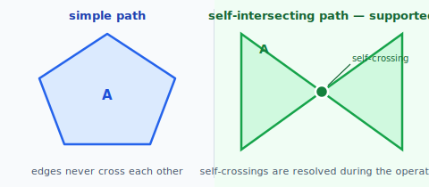
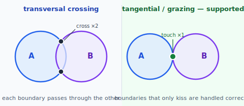
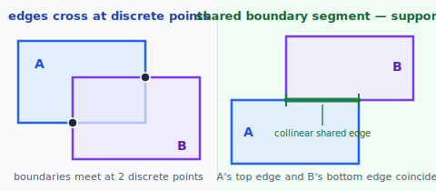
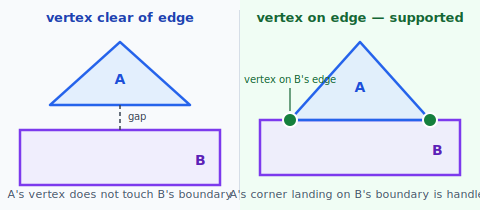

# Boolean Operations — Supported Configurations

ramanujan's boolean operations — **union**, **difference**, **intersection**, and **exclusive-or (XOR)** — handle a broad range of geometric configurations, including the degenerate cases that many libraries treat as undefined.

> **In one line:** boolean ops are correct for any pair of closed paths, regardless of how their boundaries meet.

---

## What the operations work on

- Inputs are **closed paths** (the start and end points coincide so the path encloses a region).
- **All primitive segment types are supported directly** — lines, quadratic Béziers, cubic Béziers, and elliptical/circular arcs. The boolean is computed on the **exact curve geometry**; curves are **not** flattened to polylines. Segment–segment crossings are found in their native parametric form, and intersected segments are split at their crossing parameters via the existing `bifurcateAtInterval` / `ilerp` machinery, so the result is composed of the same primitive segment types as the inputs with curved boundary preserved exactly.

---

## Fill rule

The fill rule determines what "inside" means for a path — specifically for self-intersecting paths and compound paths (multiple sub-paths treated as one shape).

**Even-odd** — cast a ray from the test point in any direction; count boundary crossings. Odd count → inside; even → outside.

**Non-zero winding** — cast the same ray but count with direction: +1 when the boundary crosses the ray going one way, −1 the other. Non-zero sum → inside; zero → outside.

For a simple convex closed path the two rules always agree. They diverge on:

- **Self-intersecting paths** (e.g. a star drawn as a single stroke): even-odd produces alternating filled/unfilled bands; non-zero fills everything inside the outer boundary.
- **Compound paths with holes** (e.g. the letter O — outer oval + inner oval drawn in the opposite winding direction): non-zero gives sum = 0 at hole points → correct hole; even-odd gives the same result coincidentally when the ovals are nested, but breaks once shapes overlap.

Paths exported from Illustrator, Inkscape, and most design tools encode holes using winding direction. A letter O, B, or P is a compound path where the inner counters are drawn clockwise while the outer shape is counter-clockwise. They rely on non-zero winding.

**Current implementation: even-odd only.** The boolean pipeline does not yet support non-zero winding. Inputs that rely on winding-direction holes will produce incorrect results. See [face_stitching.md](face_stitching.md) for what adding non-zero winding support requires.

---

## Supported configurations

### 1. Both paths are closed
Each path forms a complete loop enclosing a finite region. Open paths have no inside/outside, so boolean set operations are undefined for them.

### 2. Simple and self-intersecting paths
Both simple paths (no self-crossing) and self-intersecting paths are supported. A self-intersecting input is automatically decomposed into its simple face paths before the boolean pipeline runs. See [decompose_self_intersecting.md](decompose_self_intersecting.md).

### 3. Transversal and tangential contacts
Where edges of `A` and `B` meet, both **transversal crossings** (passing from one side to the other) and **tangential contacts** (boundaries that graze without crossing) are handled correctly.

### 4. Clean crossings and coincident edges
Both isolated edge crossings and **coincident or collinear edges** (where a segment of `A` lies along the same line as a segment of `B`) are supported.

### 5. Vertex away from edge and vertex on edge
A vertex of `A` falling exactly on an edge of `B` (and vice versa) is supported, as is the normal case where vertices are clear of the other path's boundary.

### 6. Finite and infinite intersection points
The operations handle inputs that cross at any number of isolated points, including configurations that produce a large but finite number of crossings. Fully coincident paths (where `A` and `B` are identical or share a complete boundary arc) are also supported.

---

## Floating-point caveat

The geometric distinctions above are exact in theory, but the computation is floating-point. Inputs that are *geometrically* in a supported configuration can land **near-degenerate** after arithmetic — two crossings almost coincident, or a crossing falling within rounding distance of a vertex. A small epsilon tolerance is used to absorb the common cases, but it cannot eliminate all of them. Expect occasional failures on inputs that appear normal but are numerically near a degeneracy. This is accepted.
