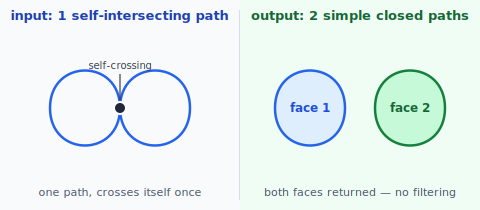
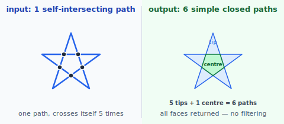

# Decompose Self-Intersecting Path

Takes a self-intersecting closed path and splits it into a list of simple (non-self-intersecting) closed paths — one per enclosed face.

## Two callers

**Break apart** — exposed directly. The caller receives all enclosed faces as simple closed paths and decides what to do with them. No fill rule is applied here.

**Boolean pre-processing** — boolean operations call this internally on any self-intersecting input before the cross-path face-split pipeline. After decomposing, the boolean pipeline classifies each resulting face as "inside" or "outside" the original shape using its own fill rule. That fill-rule logic lives in the boolean pipeline, not here.

---

## API

```
divideSelfIntersecting(path: ClosedPath) → List<ClosedPath>
```

Returns all enclosed faces as simple closed paths. Every face the path encloses — regardless of how many times the path wraps around it — is returned as a separate output path.

If the input is already simple (no self-intersections), the output is a single-element list containing the input unchanged.

---

## Algorithm

### 1. Find self-intersections

Find every pair of parameters (t₁, t₂) on the path where `path(t₁) = path(t₂)` and `t₁ ≠ t₂`. Uses the same segment-intersection machinery as boolean operations.

### 2. Split

Split the path at every self-intersection parameter. The result is a set of open curve segments whose endpoints are either the original path's start/end point or self-intersection nodes.

### 3. Build faces

From the split segments, identify every minimal enclosed face: a face is the smallest simple closed loop that can be assembled from a sequence of split segments.

### 4. Return

Return the boundary of every face as a simple closed path. Segments are oriented counter-clockwise.

---

## Example: figure-8

A figure-8 path crosses itself once, producing two enclosed faces.



Both faces are returned. Result: 2 simple closed paths.

---

## Example: star polygon

A star polygon drawn as a single path (connecting every other vertex of a pentagon) crosses itself at 5 points, producing 6 enclosed faces: 5 triangular tips and 1 central pentagon.



All 6 faces are returned. Result: 6 simple closed paths.

---

## Use in boolean operations

Boolean operations call `divideSelfIntersecting` once per input path before the cross-path pipeline:

```
facesA = divideSelfIntersecting(A)   // [A₁, A₂, …] — all simple
facesB = divideSelfIntersecting(B)   // [B₁, B₂, …] — all simple
booleanOp(facesA, facesB, fillRule)
```

The `fillRule` parameter is only used inside `booleanOp` when classifying which faces of the decomposition are "inside" each original shape. It is not used by `divideSelfIntersecting` itself.

---

## Degeneracies

| Condition | Handling |
|---|---|
| No self-intersections | return input unchanged (single-element list) |
| Tangential self-contact | touch point becomes a graph node; faces on each side remain distinct |
| Vertex-on-self-edge | split the edge at that parameter; treat as a regular node |
| Coincident self-segments (line) | collinearity + overlap-interval pass |
| Coincident self-segments (curve sub-interval) | out of scope |
