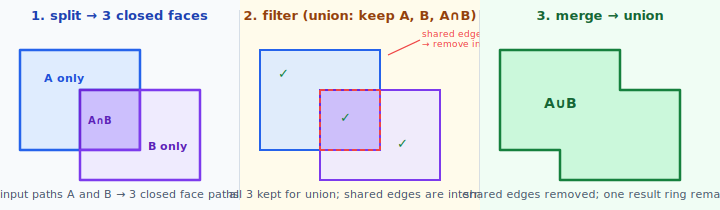
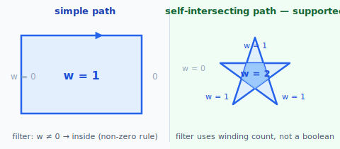
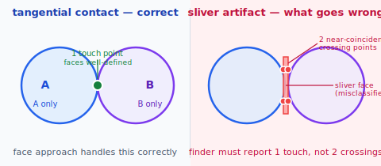
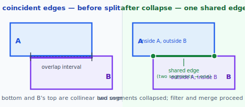
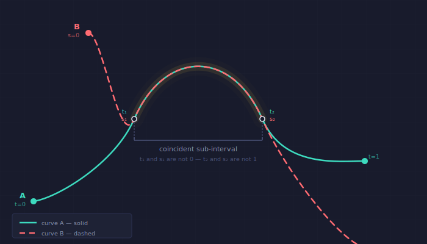
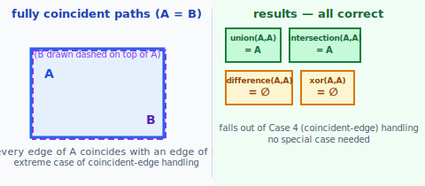

# Face Split / Filter / Merge

The core idea for boolean operations: A and B's boundaries divide the plane into discrete **faces**. Each face is either inside A, inside B, inside both, or outside both. Keep the faces the operation wants, then remove the shared internal edges between adjacent kept faces — the remaining boundary is the result.

## The four steps

Each step should be implemented independently.

**1. Path simplification** — normalise each input path into a set of simple closed faces. The sub-steps run in order:

1. **Force-close** — if the path's last point does not equal its first point, close it. If the gap is within a small epsilon, snap the endpoints to the same point (avoiding a ghost closing segment). Otherwise add a straight `LineSegment` from last to first.
2. **Decompose** — run [`divideSelfIntersecting`](decompose_self_intersecting.md) on the now-closed path. A simple closed path passes through unchanged.
3. **Drop remnants** — discard any zero-area faces produced by the decomposition (lollipop tails, hanging segments). These enclose no area and cannot contribute to a boolean area operation.

The output of this step is a set of simple, closed, non-self-intersecting paths for each input shape; these are what the remaining steps operate on.

**2. Split** — find every intersection between A's edges and B's edges. Cut all segments at those parameters. Build the planar half-edge graph and trace all CCW (positive-area) face cycles; the CW exterior face is discarded automatically. The result is a set of **closed face paths** — each face is a simple closed path that lies entirely inside or outside each input shape. Two overlapping shapes produce exactly the faces you'd expect: A-only, A∩B, B-only, and exterior.

**3. Filter** — classify each face by probing an interior point against each input region's `contains` method (respecting the region's fill rule), then keep or discard:

| face is inside… | union | intersection | difference A−B | XOR |
|---|---|---|---|---|
| A only | keep | discard | keep | keep |
| B only | keep | discard | discard | keep |
| A and B | keep | keep | discard | discard |
| neither | discard | discard | discard | discard |

**4. Merge** — any edge shared between two adjacent *kept* faces is interior to the result — remove it. The surviving boundary edges form the result rings.

---

## Does this cover the full spec?

Yes — with one exception. Every case in the spec is handled by the face approach, and the difficulty in each case lives in the **path simplification and split steps**. The filter and merge steps are mechanical once the planar graph is correctly built.

| Configuration | Covered? | Where the work is |
|---|---|---|
| Transversal crossings | ✓ easy | intersection finder, needed for the base case |
| Case 2: self-intersecting paths | ✓ yes | step 1: `divideSelfIntersecting` decomposes inputs before cross-path split |
| Case 3: tangential contacts | ✓ yes | intersection finder must classify touch-without-crossing correctly |
| Case 4: coincident line segments | ✓ yes | dedicated collinearity + overlap-interval pass in split |
| Case 4: coincident curve segments (full) | ✓ yes | polynomial coefficient comparison → linear reparametrization solve |
| Case 4: coincident curve segments (partial — ≥1 endpoint in shared region) | ✓ yes | endpoint `ilerp` probes recover overlap interval; geometric verification at interior samples |
| Case 4: coincident curve sub-intervals (both transition points interior to both segments) | ✗ not practical | nonlinear system with no closed-form solution; out of scope for all production libraries |
| Case 5: vertex on edge | ✓ yes | endpoint-on-edge check in split |
| Case 6: fully coincident paths | ✓ yes | falls out of Case 4 handling |

---

## Case 2 — self-intersecting paths

Handled by **step 1 (path simplification)**. [`divideSelfIntersecting`](decompose_self_intersecting.md) splits each self-intersecting input into simple closed paths — one per enclosed face — before the split step runs. The cross-path pipeline (steps 2–4) then operates on simple paths only and never has to deal with intra-path crossings.

`divideSelfIntersecting` returns all faces unconditionally. The fill rule is applied in **step 3**, when each decomposed face must be classified as "inside" or "outside" the original shape — which is where the fill rule's effect is observable.

### Fill rule and where it matters

For a simple (non-self-intersecting) closed path, every interior point gives the same result under both rules: the ray crosses the boundary exactly once, contributing ±1 to the winding count and 1 to the crossing count. The rules only diverge when a ray crosses the boundary more than once — which happens when the path self-intersects or is a compound path with holes.

**Even-odd** — count boundary crossings; odd → inside. Direction is irrelevant.

**Non-zero winding** — count crossings with sign: +1 when the boundary crosses the ray travelling in one direction, −1 the other. The sign is the direction of the boundary's tangent at the crossing, projected onto the ray's perpendicular axis (for a horizontal ray: +1 if the path is going upward at the crossing, −1 if going downward). Sum ≠ 0 → inside.

For a compound path encoding a hole (e.g. the letter O — outer oval CCW, inner oval CW):
- At a point inside the hole, a horizontal ray crosses the outer oval (+1) and the inner oval (−1): winding sum = 0 → outside → hole. Correct.
- Even-odd gives 2 crossings → even → outside as well — but only coincidentally when the shapes are perfectly nested. For non-trivially nested or overlapping compound paths the rules diverge.

For curve segments, the crossing sign is determined by the tangent at the crossing parameter: `sign(B'_y(t₀))` where `B'_y` is the y-component of the curve derivative and `t₀` is the crossing parameter already found by the intersection finder.

### Current implementation

Both fill rules are implemented. The classification call in `cross_split.dart` delegates to `Region.contains` (in `region.dart`), which dispatches on the region's `fillRule`:

- **Even-odd**: counts ray crossings rightward from the probe point, deduplicates near-equal x values so a vertex hit counts once, tests parity.
- **Non-zero winding**: accumulates signed crossings via `_crossingSign` (a short finite-difference sample determines whether the boundary is travelling upward (+1) or downward (−1) at the crossing), groups crossings at the same x before accumulating so a tangential touch (opposite signs cancel) correctly contributes zero, tests sum ≠ 0.

The fill rule reaches `contains` automatically because `splitAndClassify` receives the original `Region` objects alongside the decomposed faces — the region's `fillRule` is already set by the caller and requires no extra threading.

The output region always uses `FillRule.evenOdd`. The pipeline emits only CCW (positive-area) faces, so all loops are correctly oriented and both rules produce identical results on the output.

---

## Case 3 — tangential contacts

When A and B touch at a point without crossing, the faces on either side of the contact are well-defined. No face has zero area. The filter and merge steps see nothing unusual.

**The hard part is in the split step.** The intersection finder must report the tangent contact as **one touch point**, not two near-coincident transversal crossings. If it incorrectly reports two near-coincident points, a tiny sliver face appears between them. That sliver will be misclassified (it has near-zero area and is "inside both" or "inside neither" depending on the perturbation), producing a garbage artifact or a wrong result.

The face approach is correct in principle. The split step must detect tangency and avoid duplicating the contact point.

---

## Case 4 — coincident edges

### Line segments

When a segment of A lies on the same line as a segment of B and their intervals overlap, the two segments collapse to a **single shared edge** in the planar graph.

The faces on either side of the collapsed edge:
- one side: inside A, outside B
- other side: outside A, inside B

Filter and merge handle this correctly for every op. For example:
- **union**: both adjacent faces are kept → merge removes the shared edge → correct outer boundary
- **intersection**: neither adjacent face is "inside both" → result is empty (two shapes sharing only a boundary edge enclose no common interior — correct)

The split step must:
1. Detect that two segments are parallel and collinear (same line)
2. Project both onto that line and compute the overlap interval
3. Split both at the two overlap endpoints, then collapse the overlapping sub-segment to one edge

This is extra code but the geometry is straightforward.

### Curve segments

Two curve segments can coincide in two distinct ways, with very different detection costs.

There are three distinct configurations, handled with different detection strategies:

**Full-segment coincidence** — an entire segment of A traces the same geometric path as an entire segment of B. The two segments are linear reparametrizations of each other: B(s) = A(αs + β) for constants α and β. Detection is closed-form: express both as polynomials and match coefficients degree by degree.

1. Degree-3 coefficient gives α: `a₃ = b₃·α³` → one real cube root.
2. Degree-2 coefficient gives β linearly given α.
3. Verify degree-1 and degree-0 — if they match, the segments are fully coincident.

Four equations, two unknowns, overdetermined but solvable without iteration. If the verification fails, the segments are not coincident. This case is handled: the split step detects it and collapses the pair to a single shared edge, exactly as for coincident line segments.

**Partial-segment coincidence** — one or both segments extend beyond the shared region, but at least one endpoint of either segment falls within that region. This covers: A contains B, B contains A, A's tail overlaps B's head, A's head overlaps B's tail.

Detection probes all four endpoint positions via `ilerp`: where does `other.p1` land on `self`? Where does `other.p2`? Where does `self.p1` on `other`? Where does `self.p2`? Any two valid (non-NaN) probes uniquely determine the overlap interval. Coincidence is then verified geometrically at three evenly-spaced interior parameter pairs. When the full reparametrization is recoverable (A contains B entirely), a polynomial composition check `self(L(s)) − other(s) ≈ 0` confirms it algebraically. The split step then adds `tStart`/`tEnd` on A and the corresponding parameters on B as split points, producing matching sub-segments that are deduplicated to a single shared edge.

**Sub-interval coincidence** — the middle portion of one curve coincides with the middle portion of another, with both transition points strictly interior to their respective segments. None of the four endpoint probes returns a valid parameter — the overlap region is invisible to endpoint-based detection. Finding the overlap requires solving for α, β and all four bounds t₁, t₂, s₁, s₂ simultaneously — a nonlinear system with no closed-form solution.

No production library handles this case. Skia PathOps, GEOS, Clipper2, and 2geom all restrict curve coincidence handling to the full-segment case (and partially to the endpoint-overlap case). **Sub-interval coincidence where both transition points are interior to both segments is out of scope.**

---

## Case 5 — vertex on edge

A vertex of A falls exactly on an edge of B. During the split step, the endpoint of A's edge is found to lie on B's edge; that edge is split at the corresponding parameter. The vertex becomes an ordinary node in the planar graph. Filter and merge see no special case.

The only work is in the split step's endpoint-on-edge detection, alongside the normal edge-edge intersection search.

---

## Case 6 — fully coincident paths

A and B are identical. Every edge of A is coincident with an edge of B. After the coincident-edge pass from Case 4, the arrangement has no faces *between* A and B — only the shared boundary and the exterior.

Results:

| op | result |
|---|---|
| union(A, A) | A |
| intersection(A, A) | A |
| difference(A, A) | empty |
| XOR(A, A) | empty |

This is not a special case — it is the extreme application of Case 4 line-segment coincidence handling. If that pass works correctly, Case 6 is free.

---

## Summary: all difficulty is in steps 1 and 2

Steps 3 (filter) and 4 (merge) never touch raw geometry. They operate on the planar graph that steps 1 and 2 produce. Every hard case reduces to correctly building that graph:

1. **Self-intersecting paths** — step 1: `divideSelfIntersecting` decomposes each input into simple faces before cross-path work begins
2. **Transversal crossings** — step 2: segment intersection finder
3. **Vertex-on-edge** — step 2: endpoint-on-edge check alongside edge-edge search
4. **Tangential contacts** — step 2: finder must classify touch-without-crossing as one point, not two
5. **Coincident line segments** — step 2: collinearity + overlap-interval pass
6. **Coincident curve segments (full or partial)** — step 2: polynomial coefficient match for full-segment; endpoint `ilerp` probes + geometric verification for partial overlap
7. **Coincident curve sub-intervals (both transition points interior to both segments)** — out of scope
