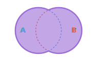
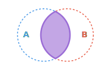
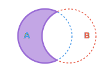
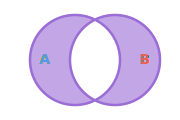
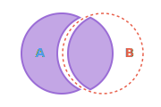
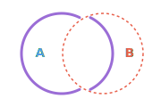
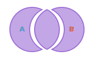
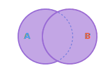
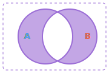
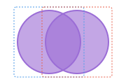

# Path Boolean and Constructive Area Geometry Operations

This document specifies the standard path boolean and constructive area geometry operations supported or referenced in this project.

## Standard Boolean Operations

These are the classical constructive area geometry (CAG) / boolean set operations. They operate on two regions $A$ and $B$, typically yielding a new closed region.

### Union
* **Description**: Merges two regions $A$ and $B$ into a single region containing all points that are in either $A$ or $B$.
* **Set Notation**: $A \cup B$
* **Illustrator Equivalent**: Unite
* **Inkscape Equivalent**: Union
* **Visual Concept**:
  

### Intersection
* **Description**: Computes the overlapping region containing only points that belong to both $A$ and $B$.
* **Set Notation**: $A \cap B$
* **Illustrator Equivalent**: Intersect
* **Inkscape Equivalent**: Intersection
* **Visual Concept**:
  

### Difference
* **Description**: Subtracts one region from another. Specifically, $A - B$ removes any part of $A$ that overlaps with $B$.
* **Set Notation**: $A \setminus B$ (or $A - B$)
* **Illustrator Equivalent**: Minus Front (or Minus Back, depending on selection order)
* **Inkscape Equivalent**: Difference
* **Visual Concept**:
  

### Exclusion (XOR)
* **Description**: Retains points that belong to either $A$ or $B$, but *not* both. Effectively creates a hole in the overlapping area.
* **Set Notation**: $A \oplus B$ (Symmetric Difference)
* **Illustrator Equivalent**: Exclude
* **Inkscape Equivalent**: Exclusion
* **Visual Concept**:
  

---

## Subdivision & Pathfinder Operations

These operations go beyond binary boolean sets to slice, trim, or fracture paths along their intersection boundaries.

### Division
* **Description**: Slices the bottom shape ($A$) into multiple pieces using the boundary of the top shape ($B$) as a cutting edge.
* **Result**: The top shape is consumed, and the bottom shape is split into separate closed paths.
* **Visual Concept**:
  

### Cut Path
* **Description**: Uses the top path ($B$) to cut the *stroke/outline* of the bottom path ($A$) at their intersection points.
* **Result**: Fills are discarded, and the bottom path's outline is broken into open path segments split at intersection points.
* **Visual Concept**:
  

### Fracture
* **Description**: Slices all selected paths along all intersection boundaries.
* **Result**: Creates a separate, independent object for every individual overlapping and non-overlapping sub-region.
* **Visual Concept**:
  

### Flatten
* **Description**: Resolves overlapping geometry by trimming away any parts of paths that are visually hidden underneath other paths (based on Z-order).
* **Visual Concept**:
  

---

## Path Utility Operations

These operations do not calculate intersections, but manipulate path structures and sub-loops.

### Combine
* **Description**: Merges multiple independent paths or shapes into a single multi-loop compound path object without calculating intersections or changing their nodes.
* **Visual Concept**:
  

### Break Apart
* **Description**: Explodes a multi-loop compound path back into separate, independent single-loop path objects.
* **Visual Concept**:
  