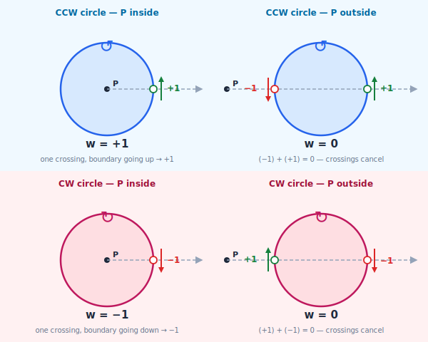

# Winding Direction and Fill Rules

This document explains winding direction and fill rules from first principles — what they mean geometrically, how they determine which regions of a compound path are filled, and how they interact.

---

## Winding direction of a single closed path

A closed path traces a loop. The loop has a direction — the order in which the points are visited. **Winding direction** (CCW or CW) describes whether that direction sweeps around the enclosed area counter-clockwise or clockwise, when viewed in the standard XY plane with Y pointing up.

For a **circle**, this is visually obvious: if the points are visited in the order top → left → bottom → right → top, the circle is CCW. Top → right → bottom → left → top is CW.

For any shape in general, the winding direction is given by the **signed area** of the path, computed with the shoelace formula:

```
signed area = ½ · Σ (xᵢ · yᵢ₊₁ − xᵢ₊₁ · yᵢ)
```

summed over all consecutive point pairs (wrapping around at the end).

- **Positive signed area → CCW**
- **Negative signed area → CW**

The shoelace formula is the definitive test. The intuition "interior on your left means CCW" is accurate for convex shapes, but fails for non-convex ones — on a concave section of the boundary the interior is not directly to your left, it is around the corner. The signed area is the only reliable method for arbitrary shapes.

---

## Winding number at a point

Given a closed path and a point P not on the path, the **winding number** of the path around P is an integer that counts how many times the path loops around P, with direction.

To compute it: cast a ray from P in any direction (conventionally rightward). For each crossing of the path boundary:

- Boundary moving **upward** at the crossing (toward the top of the screen): contributes **+1**
- Boundary moving **downward** at the crossing (toward the bottom of the screen): contributes **−1**

The winding number is the sum of all contributions.



The dashed line is the rightward ray from P. Each coloured marker is a boundary crossing: **green** (↑) means the boundary is travelling upward (+1); **red** (↓) means downward (−1). The winding number is the sum.

| path winding | P position | crossings | w |
|---|---|---|---|
| CCW | inside | one upward | **+1** |
| CCW | outside | one downward (−1) + one upward (+1) | **0** |
| CW | inside | one downward | **−1** |
| CW | outside | one upward (+1) + one downward (−1) | **0** |

Outside is always 0 regardless of winding direction — the two crossings always cancel. Inside is +1 for CCW and −1 for CW. This is why the non-zero fill rule tests `≠ 0` rather than `> 0`: both +1 and −1 are "inside."

For a compound path (multiple contours), the winding number at any point is the **sum** of each contour's individual winding number at that point.

---

## The two fill rules

Both rules answer the same question: is a given point inside or outside the filled region? They differ in what they count.

### Even-odd

Count how many times a ray from the point crosses any contour boundary. If the count is odd → inside. If even → outside.

Winding direction does not matter — only the number of crossings.

```
crossings  inside?
    0        no
    1        yes
    2        no
    3        yes
    ...
```

### Non-zero winding

Sum the winding number contributions across all contours at the point. If the sum is non-zero → inside. If zero → outside.

Direction matters: crossings in opposite winding directions cancel.

```
winding sum  inside?
    0          no
   +1          yes
   -1          yes
   +2          yes
   -2          yes
    ...
```

---

## When the rules agree and when they differ

For a single simple closed path (no self-intersections, no other contours), every interior point has exactly one crossing (winding ±1) and every exterior point has zero crossings. Both rules give identical results.

The rules diverge when a ray crosses more than one boundary — which happens with self-intersecting paths or compound paths with multiple contours.

---

## Example: two nested contours

Consider a large circle and a small circle, where the small one is entirely inside the large one.

**Case A: both CCW**

At a point inside the small circle, a ray crosses two boundaries (+1 each):
- Even-odd: 2 crossings → even → **outside** (hole)
- Non-zero: winding sum = +2 → **inside** (filled)

At a point between the two circles, a ray crosses one boundary:
- Both rules: **inside** (filled)

**Case B: large circle CCW, small circle CW**

At a point inside the small circle, a ray crosses two boundaries (+1 and −1):
- Even-odd: 2 crossings → even → **outside** (hole)
- Non-zero: winding sum = 0 → **outside** (hole)

At a point between the two circles:
- Both rules: **inside** (filled)

**Conclusion:** To produce a hole using non-zero winding, the inner contour must be wound in the **opposite direction** to the outer one. With even-odd, winding direction is irrelevant — any second nested contour produces a hole regardless of direction.

---

## Example: the letter O

A letter O has an outer oval and an inner oval. The inner oval is the counter (the hole in the middle). In design tools (Illustrator, Inkscape), the letter O is exported as a compound path with:
- Outer oval: CCW
- Inner oval: CW

Under non-zero winding (the SVG default and Illustrator's default):
- Inside the hole: winding sum = (+1 from outer) + (−1 from inner) = 0 → outside → hole ✓
- Inside the body (between the two ovals): winding sum = +1 → inside → filled ✓

Under even-odd:
- Inside the hole: 2 crossings → even → outside → hole ✓ (same result coincidentally)
- Inside the body: 1 crossing → inside → filled ✓

For a simple donut shape both rules happen to agree — but only because the contours are perfectly nested. In more complex shapes they diverge.

---

## Example: the letter B

A letter B has an outer shape and two inner counters (upper bowl, lower bowl).

Three contours: outer (CCW), upper counter (CW), lower counter (CW).

Under non-zero:
- Inside upper counter: (+1) + (−1) = 0 → hole ✓
- Inside lower counter: (+1) + (−1) = 0 → hole ✓
- In the body between counters: +1 → filled ✓

Under even-odd:
- Inside upper counter: 2 crossings → hole ✓
- Same for lower counter ✓

Again they agree for simple nesting. The difference appears in more complex configurations like self-intersections or overlapping contours.

---

## Example: star polygon (self-intersecting)

A five-pointed star drawn as a single closed path (pentagram, one continuous stroke). The path crosses itself, creating an inner pentagon.

Under even-odd:
- Inner pentagon: a ray crosses 4 boundaries → even → **outside** (unfilled centre)
- Points in the triangular points: 1 crossing → inside → filled

Under non-zero:
- Inner pentagon: winding sum = +2 (crossed twice in the same direction) → **inside** (filled)
- The entire star including centre is filled

This is a genuine difference. Both representations are valid; which is "correct" depends on the design intent.

---

## Example: bullseye (three nested contours, alternating direction)

Three concentric circles: outermost CCW, middle CW, innermost CCW.

At a point inside the innermost circle, winding contributions: +1 (outer) + (−1) (middle) + (+1) (inner) = +1 → inside (filled).
At a point between middle and inner: +1 + (−1) = 0 → outside (hole).
At a point between outer and middle: +1 → inside (filled).

Result under non-zero: three alternating rings — filled, hole, filled from the outside in. Exactly the bullseye pattern.

Under even-odd the same structure emerges from crossing count (1, 2, 3 crossings) — the fill rule choice does not change the visual result here, because the winding directions were chosen to match the even-odd nesting.

---

## Why winding direction alone does not determine fill

A CW contour by itself (no surrounding contours) has winding sum = −1 everywhere inside it. Under non-zero that is non-zero → **inside** → filled. CW does not mean "hole" in isolation; it only produces a hole when it cancels a surrounding CCW contour.

Similarly, a CCW contour inside another CCW contour produces winding sum = +2 under non-zero → still inside → no hole, even though it is nested. To make it a hole under non-zero, it must be wound CW.

Under even-odd, winding direction is irrelevant — a nested contour always produces a hole regardless of direction.

---

## The convention Ramanujan uses for output

Boolean operations return a `CompoundPath` whose contours follow this convention:

- Outer-boundary contours are wound **CCW**
- Inner-boundary contours (holes) are wound **CW**

This convention is chosen because it renders correctly under **either** fill rule:
- Under non-zero: outer (+1) and inner (−1) cancel inside holes → correct
- Under even-odd: odd vs even crossings produce the same pattern → correct

This is a promise about what the boolean pipeline produces, not a general semantic of CCW/CW. An input `CompoundPath` from external SVG may use any combination of windings; the fill rule on that input is what determines what "inside" means.

---

## Summary

| | Even-odd | Non-zero |
|---|---|---|
| What is counted | number of boundary crossings | signed sum of crossings |
| Winding direction matters | no | yes |
| Hole encoding | any nested contour | opposite-direction contour |
| SVG keyword | `evenodd` | `nonzero` |
| SVG default | no | yes |
| Ramanujan output | always used | — |
